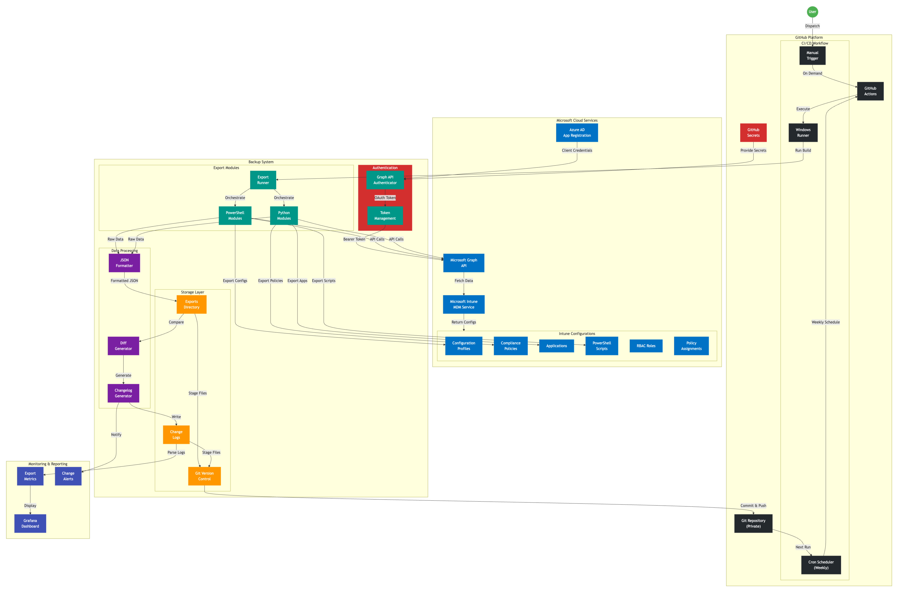

# Intune Configuration Backup as Code

This repository contains an automated solution for backing up Microsoft Intune configurations to Git with version control and change tracking.

## Overview

This system automatically:
- Exports all Microsoft Intune configurations via Microsoft Graph API
- Stores configurations as JSON/YAML files in Git
- Tracks changes between backups with detailed change logs
- Runs weekly via GitHub Actions (with manual trigger option)
- Provides integration points for monitoring (e.g., Grafana)

## Architecture

The solution uses:
- **PowerShell** and **Python** modules for different Intune components
- **Microsoft Graph API** for data retrieval
- **GitHub Actions** for scheduled automation
- **Git** for version control and history



## Quick Start

1. **Set up Azure AD App Registration**
   - Create app registration with Graph API read permissions
   - Required permissions: `DeviceManagementConfiguration.Read.All`, `DeviceManagementRBAC.Read.All`

2. **Configure GitHub Secrets**
   - `AZURE_TENANT_ID`
   - `AZURE_CLIENT_ID`
   - `AZURE_CLIENT_SECRET`

3. **Deploy to GitHub**
   - Push this repository to a private GitHub repository
   - GitHub Actions will automatically run weekly or on manual trigger

## Repository Structure

```
IntuneBackupRestore/
├── .github/workflows/      # GitHub Actions workflows
├── src/                    # Source code
│   ├── modules/           # Export modules (PowerShell & Python)
│   └── utils/             # Shared utilities
├── exports/               # Exported Intune configurations
├── change_logs/           # JSON change logs
├── tests/                 # Test suite
├── docs/                  # Additional documentation
└── scripts/               # Setup and utility scripts
```

## Building and Running

For detailed build instructions and dependency management, see [BUILD.md](BUILD.md).

**Quick Start:**
```batch
# Install dependencies and run exports
.\build.cmd Install
.\build.cmd ExportAll
```

## Development

See [DEVELOPMENT_PLAN.md](DEVELOPMENT_PLAN.md) for detailed implementation guide.

## Security

- All data is stored in a private repository
- Credentials are managed via GitHub Secrets
- App registration uses read-only permissions
- No sensitive secrets are exported to the backup

## Support

This is an internal tool. For issues or questions, contact the Client Platform Engineering team.
